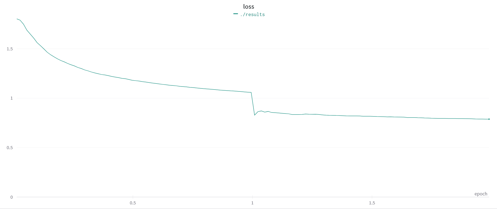
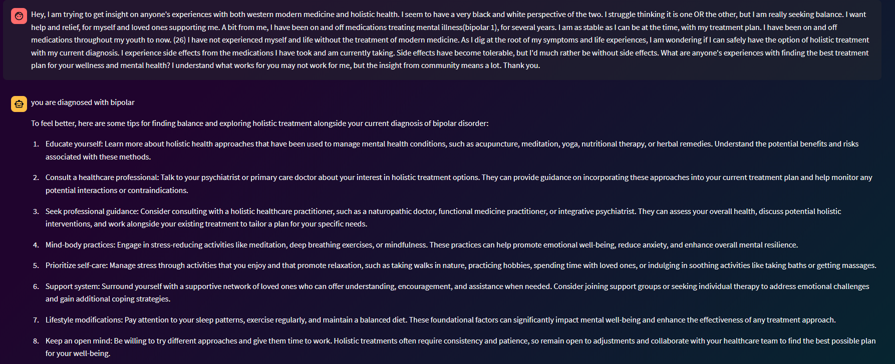

# 👨🏼‍⚕️ RAZI.AI
An Ai that can detect mental health issues and provide solutions to them.

Try it out [here](https://raziai.streamlit.app/)


[](https://github.com/BaseMax?tab=repositories)

## Inspiration
Mental health is a very important issue that is often overlooked. We wanted to create a solution that would help people with mental health issues and provide them with solutions to their problems.

## Architecture
We used a streamlit web app to create the front end of our project.
For mental illness detection we used a fine-tuned BERT model with a over 70 000 data points.
For the solutions we used the GPT-3 API to generate solutions to the problems.


## Dataset
We used the [Mental Disorders Identification (Reddit)](https://www.kaggle.com/datasets/kamaruladha/mental-disorders-identification-reddit-nlp) dataset from Kaggle.

## Fine-tuning BERT
We used the [BERT]( https://huggingface.co/transformers/model_doc/bert.html) model from the [Hugging Face](https://huggingface.co/) library.

We ran the training for 2 epochs and the loss went from 1.8 to 0.6



## Solution Generation
We used the [OpenAI](https://openai.com/) API to generate solutions to the problems,but it's recommended to visit a psychologist if you have any mental health issues.

## Incoming Features
* ✔️ Add more mental health issues
* ✔️ Add speech to text functionality
* ✔️ Show closest mental health facilities

## How to run
1. Clone the repo
```bash
git clone https://github.com/wassim249/RAZI.git
```
2. Install the dependencies
```bash
pip install -r requirements.txt
```
3. Get your OpenAI API key and add it to the streamlit toml file
4. Run this command in the terminal
```bash
streamlit run app.py
```
5. Open the link in the terminal

## Example


[](https://github.com/BaseMax?tab=repositories)

## Contributors
- [Fatima Zahra MOUMENE](moumene.fatimazahra2000@gmail.com)
- [Wassim EL BAKKOURI](wassim.elbakkouri@yahoo.com)

## License
[MIT](https://choosealicense.com/licenses/mit/)

## Acknowledgements
- [Hugging Face](https://huggingface.co/)
- [OpenAI](https://openai.com/)
- [Kaggle](https://www.kaggle.com/)
- [Streamlit](https://streamlit.io/)
- [Tensorflow](https://www.tensorflow.org/)
- [Weights & Biases](https://wandb.ai/site)

